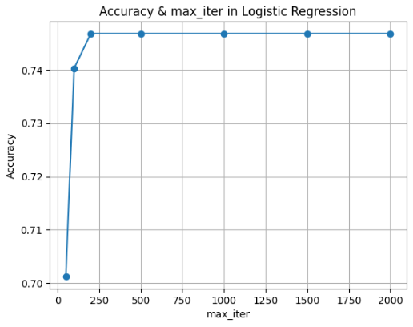

## Predict whether a patient has diabetes

### Goal: -To predict whether a patient has diabetes

#### Data Source https://www.kaggle.com/datasets/uciml/pima-indians-diabetes-database

## Reason for choosing LogisticRegression:
-> Since PIMA diabetes dataset has a binary outocme and logistics regression is perfect for binary classification. Also it makes it easy to understand outcome of each features like glucose level or BMI influence.

## Reason for max_iter = 250:
-> The default setting is 100 and when compared with different value, accuracy reached its max threshold of 0.75 around 250.

